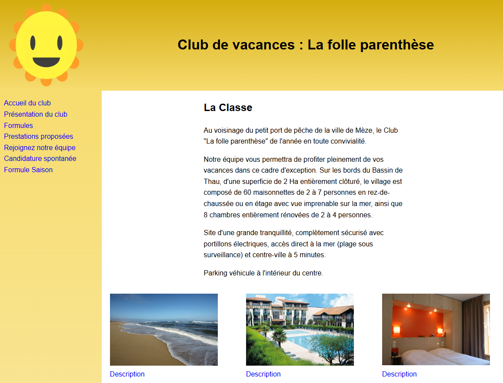
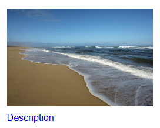
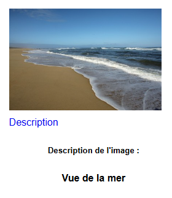

# Cas de synthèse javascript

## Contexte
Vous disposez du site de présentation d’un club de voyages « La folle parenthèse ». Votre tuteur de stage a 
pour mission de réaliser quelques mises à jour sur l’aspect global du site ; il vous charge d’effectuer cette activité 
en respectant les contraintes suivantes :

## Travail à faire
1. Vous avez à votre disposition un fichier de styles (`style.css`) contenant des mises en forme utile à votre travail.
2. Créez un fichier `appClass.js` dans le répertoire `js`
3. Écrire le code javascript qui permet d'obtenir avec les pages `index.html` et `accueil.html` le résultat suivant :

4. Réaliser les modifications pour toutes les autres pages du site.
5. Écrire le code qui permet au fichier `formules.html` d'afficher les données de `chambre.json`
6. Toujours dans `formules.html` affichez les informations du formulaire et le montant à payer sachant les tarifs suivants :

| Type de chambre |  	Tarif |
|-----------------|--------:|
| Chambre simple  |   	65 € |
| Chambre double  |   	75 € |
| Chambre triple  |   	90 € |

7. Écrire le code qui permet au fichier `simulation.html` d'afficher les données de `chambreSaison.json`
8. Affichez les informations du formulaire et le montant à payer sachant les tarifs suivants :

| Type de chambre |  	Basse Saison |  Haute Saison |
|-----------------|---------------:|--------------:|
| Chambre simple  |          	65 € |          75 € |
| Chambre double  |          	75 € |          85 € |
| Chambre triple  |          	90 € |         105 € |

Les dates des saisons sont les suivantes :

**Basse saison** :
- Du 05/01 au 14/06
- Du 07/09 au 07/12

**Haute saison** :
- Du 15/06 au 06/09
9. Écrire le code qui permet d'avoir ou pas la description de la photo dans la page `accueil.html` en clickant dessus :

   État à l'ouverture de la page :  

   État aprés le click sur le lien :  

